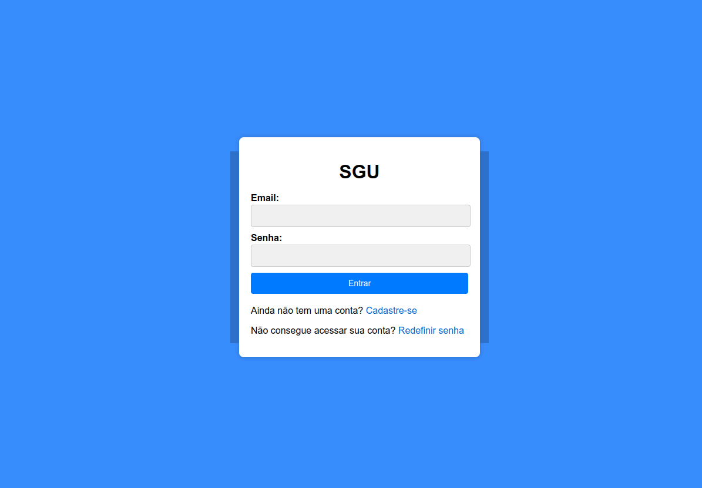

<h1 align="center">Sistema de Gerenciamento Acadêmico</h1>

Sistema de Gerenciamento Acadêmico é parte do projeto para entrega na disciplina de 'Projeto Interdisciplinar de Computação' no 4º Semestre de Ciência da Computação no Instituto Federal de São Paulo Campus Salto.

Está em desenvolvimento, com algumas funções já podendo ser utilizadas pela versão publicada.
Estarei realizando ajustes no período de 1 semana, quanto a estilização de cada template.

<h4 align="center"><a href="https://sistema-de-gerenciamento-academico.onrender.com/">Clique para visitar o projeto</a></h4>

---

## O site é composto por seções de:

- Cadastro: Realização do cadastro no site;
- Login: Login com suas informações;
- Redefinir senha: Caso esqueça sua senha, pode redefiní-la utilizando seu endereço de e-mail;
- Ínicio: Com horários de aula das disciṕlinas cadastradas;
- Disciplinas: Visualização das disciplinas cadastradas e inserção de novas;
- Relatório: Futura implementação com fornecimento de relatórios do andamento na disciplina, acompanhamento de frequência e notas.
- Mensagens: Futura implementação com possibilidade de visualização de informações e notificações;

---

## Tecnologias utilizadas

Para o desenvolvimento deste site utilizei as seguintes tecnologias:

- HTML;
- Python;
- Flask;
- JavaScript;
- SQLite3; 

---

## Autor

<table>
  <tr>
    <td align="center">
      <a href="https://github.com/iuricode">
         
        
          <b>Gabriel Iope</b>
        
      </a>
    </td>
  </tr>
</table>

